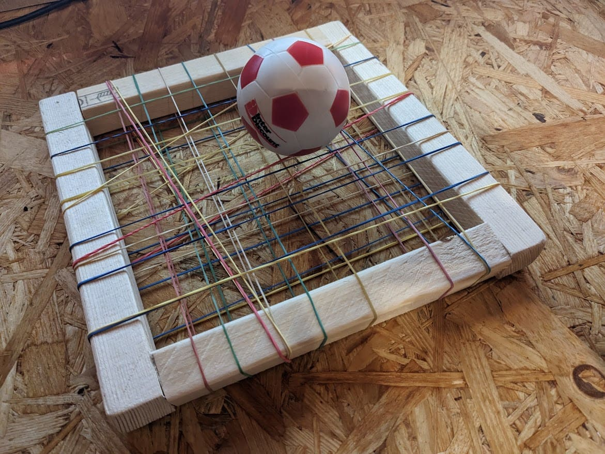

# Basteln

- Bogen basteln & schiessen  
  Referenz-Artikel: [mamagie.de](https://www.mamagie.de/2019/05/14/diy-dienstag-pfeil-und-bogen/)
- Fimo Figuren
- Fimo Besteck
- Papier Flieger  
  Referenz-Artikel: [kidactivities.net](https://kidactivities.net/paper-airplane-game-for-kids/)
- Papierrakete (mit Ständer und Pet Flasche)  
  Block Hela22 Sparrows: [Hela22-Papierrakete.pdf](../assets/Hela22-Papierrakete.pdf)
- Wasserfilter
- Wasserrakete
- Steinschleuder bauen
- Baumgesichter  
  Referenz Artikel: [adailytravelmate.com](https://www.adailytravelmate.com/spielen-im-wald-10-spielideen-fuer-kinder-im-wald/)  
  Google Bilder: [google.com](https://www.google.com/search?q=Baumgesichter+basteln&client=firefox-b-d&sxsrf=AJOqlzU4yHhjFG_dib1v7GZQi_fyebz4Cw:1676807786615&source=lnms&tbm=isch&sa=X&ved=2ahUKEwiK-ejjw6H9AhXbh_0HHaW5A0cQ_AUoAXoECAEQAw&biw=1536&bih=703&dpr=1.25)
- Karton Dino Kopf  
  Referenz Artikel: [zygotebrowndesigns.com](https://www.zygotebrowndesigns.com/post/dinosaur?epik=dj0yJnU9V01KY2hGeUFaa1lNbGNHdlRNenp5a2VYQ0F4enlBVFEmcD0wJm49Q1I5MVIyRUxudkVVMFdFbzk2ZklpQSZ0PUFBQUFBR1B5RWM4)  
  Pinterest Bild: [pinterest.de](https://www.pinterest.de/pin/822469950726236143/)
- Papierrakete 
- Flugspeer  
  Referenz-Artikel: [familie.de](https://www.familie.de/diy/flugspeer-basteln/)
- Intercorss Schäger
  YouTube Video: [youtube.com](https://youtu.be/3FXUcbrGHfU)  
  Block Pfila23 Sparrows: [Pfila23-Intercrosse.pdf](../assets/Pfila23-Intercrosse.pdf)
- Schläger mit Gummis  
  YouTube Video: [youtube.com](https://youtu.be/jMMoHXzIE8s)  
  
- Ping Pong Schläger
- Mini Golf (Gold Schläger bauen, selber Mini Gold Anlage mit Hindernissen bauen)
- Spiel Karten (Zeichnen)
- freie Erfindung (zB. zu gewissen Materialien / zu einem Thema)
- Spielbrett (Spiel selber erfinden)
- Pfeilbogen
- Frisbee

## Schnitzen

Sicherheitshinweise Schnitzen mit Kindern: [https://www.jugendleiter-blog.de/2018/06/10/schnitzen-kinder/](https://www.jugendleiter-blog.de/2018/06/10/schnitzen-kinder/)

- Pfeile / Speer schnitzen (+ verzieren [Pinterest](https://www.pinterest.de/pin/102738435239569328/))
- Löffel, Gabel oder Messer schnitzen
- Holz Tiere  
  Elefant Artikel: [geo.de](https://www.geo.de/geolino/basteln/22109-rtkl-anleitung-so-schnitzt-ihr-einen-elefanten)
